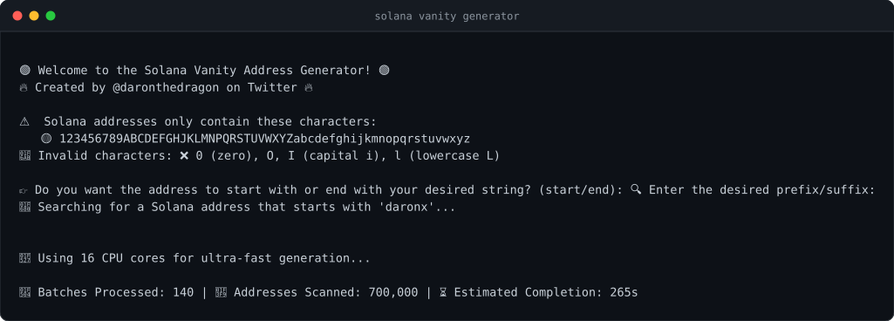

<div align="center">

# 🚀 Solana Vanity Address Generator

**Generate a Solana wallet address that starts or ends with whatever you want.**

🔥 Created by [@daronthedragon](https://twitter.com/daronthedragon) 🔥

[](https://nodejs.org/)
[](#-security)
[](#-license)

</div>

---

Every CPU core generates keypairs until one of them lands an address matching your pattern. No servers, no APIs — the search happens on your machine and the key never goes anywhere.

<p align="center">
  
</p>

<sub>A real run: 16 cores, 646,000 addresses a second. The result screen is deliberately not shown — it prints a live private key.</sub>

---

## 📥 Install

```sh
git clone https://github.com/daronthedragon/solanavanitygenerator.git
```

```sh
cd solanavanitygenerator && npm install
```

```sh
node gen.js
```

Needs Node 16+. The install pulls in `sodium-native` for the fast path; if it
cannot build on your machine that is fine, the tool falls back to Node's own
crypto and still runs at roughly nine times the original speed.

📖 New to the terminal? The [install guide](INSTALL.md) walks through Windows and macOS step by step.

---

## 📝 How it works

**1. Pick `start` or `end`** — whether your pattern should be a prefix or a suffix.

**2. Enter your pattern.** Solana addresses are Base-58, so only these characters exist:

```
123456789ABCDEFGHJKLMNPQRSTUVWXYZabcdefghijkmnopqrstuvwxyz
```

There is no `0`, no capital `O`, no capital `I`, and no lowercase `l`. The tool rejects them rather than searching forever for something impossible.

**3. Wait.** A live ticker shows batches processed, addresses scanned, and an estimate. Every core is working.

**4. Copy your keys.** When a match lands, the public key and the private key are printed, along with how long it took.

### ⏱ How long does it take?

Each extra character multiplies the search by 58. At the ~650,000 addresses a
second this manages on a 16-core desktop:

| Pattern | Expected attempts | Expected time |
| :--- | ---: | :--- |
| 3 characters | 195,112 | under a second |
| 4 characters | 11.3 million | ~17 seconds |
| 5 characters | 656 million | ~17 minutes |
| 6 characters | 38 billion | ~16 hours |
| 7 characters | 2.2 trillion | ~5 weeks |

Case matters, so `SOL` and `SoL` are different searches, and suffixes cost the
same as prefixes. The live estimate in the ticker is computed from your actual
measured rate and the pattern you asked for, so it gets more accurate the
longer it runs.

## ⚡ Speed

The search is one thing repeated forever: derive an Ed25519 public key, encode
it, compare. So the tool is only ever as fast as those three steps, and the
first version left most of the performance on the floor.

| Backend | Addresses/sec, 16 cores | |
| :--- | ---: | :--- |
| tweetnacl, BigInt base58 | 58,000 | the original |
| Node's built-in crypto | ~700,000 | no dependencies |
| libsodium | **768,000** | optional native module |

Measured back to back on the same machine, same pattern: **13x faster**.

Three things got it there.

**Ed25519 derivation** is the dominant cost, and `Keypair.generate()` from
`@solana/web3.js` uses tweetnacl, a pure-JavaScript implementation. libsodium
is roughly 19x quicker at the same job; Node's own `crypto` is roughly 9x.
Whichever loads first is used, so there is no configuration and no way to end
up with a broken install — see [`backends.js`](backends.js).

**The secret key was being base58-encoded on every attempt** and thrown away
unless it matched. It is now encoded once, on the match.

**Base58 itself** converted each key into a single BigInt and divided it down,
allocating per digit. Long division over a reused byte array is about 4x
quicker and allocates nothing.

No GPU is involved. A GPU would go faster still, but it means reimplementing
Ed25519 in a shader — and a subtle bug there produces wallets nobody can open,
which is a poor trade for a tool whose entire job is producing keys you can
open.

## 🔒 Security

**Everything happens locally.** Keys are generated on your machine with Node's cryptographic random source, and nothing is transmitted anywhere. There is no server, no API call, and no telemetry. You can read all of [`gen.js`](gen.js) in a few minutes — that is the point of it being open source.

Two things worth knowing anyway:

- **The private key is printed to your terminal.** That means it lands in your scroll-back, and in any recording or screen-share running at the time. Move it into your wallet, then clear the screen.
- **A vanity address is not a safer address.** It is a normal keypair that happened to match a pattern. Treat the key exactly as you would any other.

---

## 🐛 Fixed: keys that would not import

If you generated a wallet with an older version of this tool and your wallet app **rejected the private key**, that was a bug here, not something you did.

Base-58 encodes every leading zero byte as a literal `1`. The old encoder treated the key as one big number, which silently dropped those leading zeros and produced a shorter string that decodes back to the wrong bytes. Roughly **1 in 313** keys starts with a zero byte, so about that share of generated wallets exported a string no wallet could import.

This is fixed. Keys generated now encode correctly, verified against every key in a 20,000-keypair sample that starts with a zero byte.

Also fixed in the same pass: worker threads now shut down once a match is found, instead of pinning every core at 100% while the result sits on screen.

---

## ❓ FAQ

**Does this work on Windows, macOS and Linux?**
Yes, all three. See [INSTALL.md](INSTALL.md).

**Can I import the result into Phantom or Solflare?**
Yes. The private key is printed in the Base-58 format wallets expect.

**Can I make the search faster?**
It already uses every core and the fastest Ed25519 implementation it can load.
Check the startup line: if it says `via libsodium` you are on the fast path. If
it says `via node crypto`, `sodium-native` did not build, which costs about
half the speed but changes nothing else. Beyond that the only lever is a
shorter pattern - each character you drop makes it 58x quicker.

**Is a longer pattern more secure?**
No. Every address here has the same 256-bit keypair behind it. A longer pattern is purely cosmetic and costs more CPU.

---

## 🤝 Contributing

Issues and pull requests are welcome.

---

## 📜 License

MIT.

<div align="center">

⭐ **If you found this useful, consider starring the repo!** ⭐

</div>
